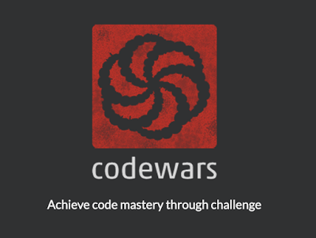

# Daily Kata
Daily challenges from Codewars.

## How It's Done:

**Language:** JavaScript

VSCode to refactor code and GitBash to push code to GitHub. Starting from the humble 8kyus and working my way up.

## Lessons Learned:

Being an engineer means continuously learning. It's ok to not know something and it feels great when things finally click!

